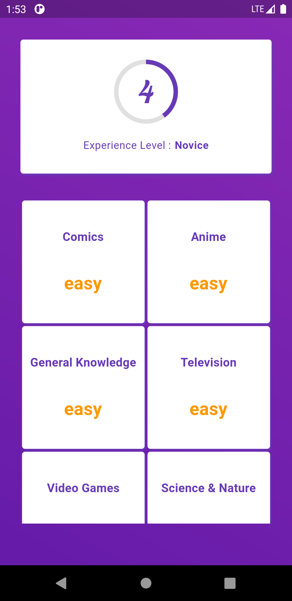
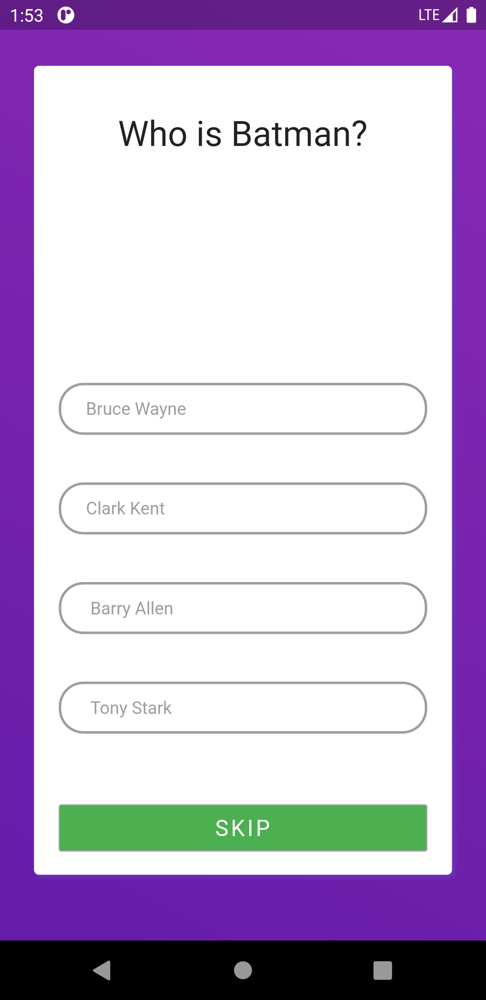
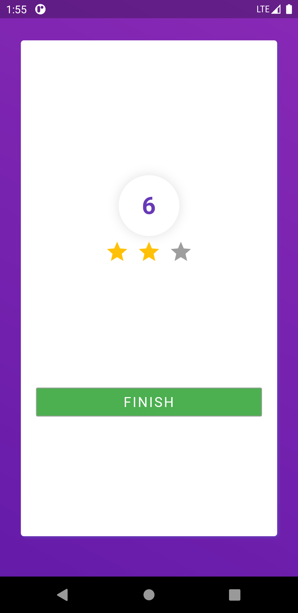

# Online Quiz-App Flutter
This is a quiz app that uses the Trivia database API to get questions\
on various genres through an HTTP request.
 
### Languages & tools :
[][android]
[][dart]
[][flutter]
  

|Home Screen| Quiz Screen | Quiz Score Screen |
|------|-------|-------|
||||

### Directory Structure :
    |-- quiz_app_flutter
    |    |-- android
    |    |
    |    |-- Assets
    |    |   |--fonts
    |    |       |-- Lobster-Regular.ttf
    |    |
    |    |-- ios
    |    |
    |    |-- lib
    |    |   |-- main.dart
    |    |   |-- constants.dart
    |    |   |-- home_screen.dart
    |    |   |-- loading_screen.dart
    |    |   |-- quiz_info_model.dart
    |    |   |   
    |    |   |-- Widgets
    |    |       |-- app_bar.dart
    |    |
    |    |-- pubspec.lock
    |    |-- pubspec.yaml
    |
    |-- Img
    |    |-- androidstudio.png
    |    |-- dart.png
    |    |-- flutter.png
    |    |-- quizApp1.png
    |    |-- quizApp2.png
    |    |-- quizApp3.png
    |
    |-- README.md
## Connect with me:  

  
 

[website]: https://abhilashtuofficial.github.io/
[dart]: https://github.com/AbhilashTUofficial/CloneApps
[flutter]: https://github.com/AbhilashTUofficial/QuizApp-Flutter
[android]: https://github.com/AbhilashTUofficial/QuizApp-Flutter

